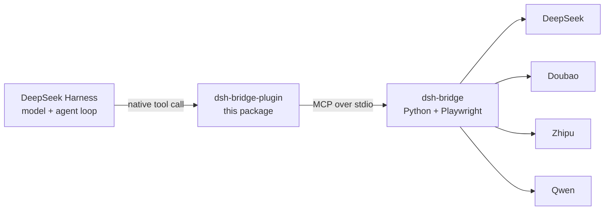

# dsh-bridge-plugin

[](https://www.npmjs.com/package/dsh-bridge-plugin)
[](LICENSE)
[](#requirements)
[](https://nodejs.org)

> **Ask four web AIs from inside DeepSeek Harness — no API keys, no API bills.**

`dsh-bridge-plugin` exposes a locally running [dsh-bridge](https://github.com/elysiamsia/dsh-bridge)
as **native DeepSeek Harness tools**. It drives real, logged-in browser sessions on
DeepSeek / Doubao / Zhipu / Qwen and returns their answers — consuming free web quotas
instead of paid API tokens.

The business logic (Playwright automation, stealth, fallback chains, quality review,
rate-limit state machine) stays in the **Python** bridge. This plugin is only a thin
native shell that reuses it over MCP stdio — **nothing is reimplemented**.

[中文说明](README.zh-CN.md) · [Why not just MCP?](#why-a-native-plugin) · [Troubleshooting](#troubleshooting)



## Features

| | |
|---|---|
| 🧩 **Native tools** | `ask_deepseek` appears as a first-class DSH tool — no `mcp__…__` prefix |
| ♻️ **One shared core** | The same Python bridge the MCP integration uses; no duplicated logic |
| 🛡️ **Built-in G20 guard** | Refuses to send while a site is frozen, *before* touching the network |
| 🪶 **Zero dependencies** | Pure ESM JavaScript, hand-rolled MCP client, no npm deps |
| 🔍 **Opt-in diagnostics** | Breadcrumb logging you enable only when something misbehaves |
| 🔌 **Fail-soft** | A bridge problem degrades this plugin only; it never takes DSH down |

## Why a native plugin?

DeepSeek Harness [already speaks MCP](https://github.com/deepseek-ai/deepseek-harness), so
the MCP path needs **zero code**. A native plugin buys what MCP cannot:

| | MCP bridge | This plugin |
|---|---|---|
| Tool name | `mcp__dshbridge__ask_deepseek` | `ask_deepseek` |
| UI | generic MCP rendering | native `presentCall` card |
| Config | MCP env/args | DSH `Config` (Standard Schema) |
| Lifecycle | managed by the MCP client | Cordis fiber, auto-cleanup on unload/HMR |

## Requirements

| Requirement | Notes |
|---|---|
| **DeepSeek Harness** | Desktop `0.2.0-rc.2` verified; declares `dsh >= 0.1.7-rc.1` |
| **Node.js ≥ 20** | Provided by the DSH host itself |
| **dsh-bridge** | The Python project (`uv` managed, Python ≥ 3.11) |
| **Playwright browser** | `uv run playwright install chromium` inside dsh-bridge |
| **Site logins** | `uv run dsh-login <site>` before real-site calls |

## Install

### Option 1 — npm (simplest)

In DSH open **Settings → Plugins → Add plugin** and paste the package name:

```
dsh-bridge-plugin
```

Or from a shell:

```sh
dsh plugin add dsh-bridge-plugin
```

### Option 2 — local directory

Clone this repo, point the Add-plugin dialog at the folder, or use the bundled offline
installer (equivalent to `dsh plugin add`, plus post-install verification):

```powershell
powershell -ExecutionPolicy Bypass -File install.ps1
# uninstall:
powershell -ExecutionPolicy Bypass -File install.ps1 -Uninstall
```

### Option 3 — GitHub

```
https://github.com/elysiamsia/dsh-bridge-plugin
```

> **Then fully quit and restart DSH Desktop.** Closing the window may only minimize it to
> the tray — quit from the tray icon, or confirm no `DeepSeek Harness` process remains.

## Configure

**This package ships no machine-specific paths** — its defaults assume `dsh-bridge` is on
your `PATH` (e.g. after `uv tool install .` in the dsh-bridge checkout).

Running from a **source checkout** is the common case, and that path belongs in *your*
profile, not in a published package. Add an override to
`~/.dsh/profiles/<profile>/cordis.patch.yml`:

```yaml
# Replace with YOUR absolute path to the dsh-bridge checkout
- id: dsh-bridge-plugin
  config:
    command: uv
    args: [run, --no-sync, dsh-bridge]
    cwd: /absolute/path/to/dsh-bridge
    toolCallTimeoutMs: 180000
```

> A patch **replaces the whole `config` object** for that id, so list every field you need.

<details>
<summary><b>All configuration fields</b></summary>

| Field | Default | Purpose |
|---|---|---|
| `command` | `dsh-bridge` | Executable that starts the bridge |
| `args` | `[]` | Arguments passed to `command` |
| `cwd` | `""` | Working directory (inherited when empty) |
| `env` | `{}` | Extra environment variables |
| `toolCallTimeoutMs` | `180000` | Per-call timeout; real-site asks drive a browser |

`PYTHONIOENCODING=utf-8` and `PYTHONUTF8=1` are always forced on the child process — the
bridge prints emoji, and Windows' default GBK console would crash it.

</details>

## Usage

Once loaded, the model can call the tool directly:

```
Use ask_deepseek to explain the CAP theorem, then summarize it in two sentences.
```

<details>
<summary><b>Tool reference</b></summary>

| Tool | Parameters | Returns |
|---|---|---|
| `ask_deepseek` | `prompt` (required), `conversation_id` (optional) | `{ reply, conversation_id?, site }` |
| `dsh_bridge_probe` | `echo` (optional) | `{ ok, plugin, echo? }` — proves the plugin loaded |

`dsh_bridge_probe` is a zero-dependency diagnostic: if it works but `ask_deepseek` does
not, the problem is the bridge, not the plugin.

</details>

## ⚠️ Rate limit — read before using real sites

This project is built around one hard rule:

> **Every real-site smoke run revokes all four site accounts at once.**

| Rule | |
|---|---|
| Allowed site | `deepseek` only, smoke tests only |
| Precondition | `uv run --no-sync dsh-verify readiness` must report `hours_left >= 6.0` |
| Renewal | `uv run --no-sync dsh-login deepseek` |

**The bridge's `ask` path does not check the rate limit itself** — so this plugin adds a
**pre-flight gate**: before sending, it reads the verify state through the bridge's
pure-logic `route_task` call (no browser, no network) and refuses when the site is frozen,
returning an actionable `dsh-login` message. If the pre-flight check *itself* fails, the
plugin **fails closed** rather than risk sending.

## Troubleshooting

### Switch on diagnostics

Logging is **off by default**. Turn it on for one run:

```powershell
$env:DSH_BRIDGE_PLUGIN_DIAG = "$env:TEMP\dsh-bridge-plugin.log"
```

The plugin then writes breadcrumbs for module import, `apply` entry (including the real
shape of `ctx`), every step, and any exception with a full stack. This is how the
"plugin loads but the tool never appears" class of bug is solved without guessing.

### The tool never appears

| Symptom | Check |
|---|---|
| Plugin row shows *failed* | `DSH_BRIDGE_PLUGIN_DIAG` — the log names the failing step |
| Plugin not listed at all | It was never installed, or DSH was not fully restarted |
| DSH crashes at startup | `%APPDATA%\@deepseek-ai\dsh-desktop\logs\crash-*-host.log` |

<details>
<summary><b>A UTF-8 BOM in the profile manifest crashes DSH at startup</b></summary>

DSH reads the profile's `package.json` with a bare `JSON.parse`. A BOM makes it throw
`SyntaxError: Unexpected token ''` at `readProfileManifest` — a startup crash.

Windows PowerShell 5.1's `Set-Content -Encoding UTF8` **writes a BOM**. Always write
BOM-less:

```powershell
[System.IO.File]::WriteAllText($path, $json, (New-Object System.Text.UTF8Encoding($false)))
```

`install.ps1` does this and asserts the result. Mind the inverse trap too: **PowerShell
scripts containing non-ASCII text must have a BOM**, or PS 5.1 decodes them as GBK and
fails to parse.

</details>

## Development

```sh
node probe/verify-plugin.mjs                    # pure + registry layers, no browser needed
# then, to also exercise the real bridge:
export DSH_BRIDGE_REPO=/path/to/dsh-bridge      # PowerShell: $env:DSH_BRIDGE_REPO="..."
node probe/verify-plugin.mjs
```

| Script | Purpose |
|---|---|
| `probe/verify-plugin.mjs` | Self-check: pure functions, tool registration, pre-flight gate, bridge |
| `probe/verify-loader.mjs` | Replays the host loader's six steps against an installed profile |
| `probe/verify-profile.mjs` | Profile health check (per bundle, detects BOM) |
| `probe/mcp-probe.mjs` | Raw Node → Python MCP handshake + `tools/list` |
| `probe/asar-extract.mjs` | Read a file out of DSH's `app.asar` (`DSH_ASAR=…`) |

Machine-specific paths are **never** committed: every script takes them from environment
variables and tells you what to set when one is missing.

## Releasing

Releases are automated by [`.github/workflows/publish.yml`](.github/workflows/publish.yml),
which publishes to npm when a `v*` tag is pushed:

```sh
npm version patch        # or minor / major — bumps package.json and creates the tag
git push --follow-tags   # the tag triggers the workflow
```

The workflow verifies that the tag matches `package.json`, runs the offline self-check,
then publishes with provenance. It needs a repository secret named `NPM_TOKEN` — a
**granular access token with "Bypass 2FA" enabled** (this npm account uses 2FA; a plain
token is rejected in CI with `E403`). You can also trigger it manually from the Actions
tab, where the default is a `--dry-run`.

## Contributing

Issues and pull requests are welcome. Please run the self-check above before opening a PR,
and keep the zero-dependency constraint — this package must stay installable via
`dsh plugin add` with no build step and no transitive dependencies.

## License

[MIT](LICENSE)

## Acknowledgements

- [dsh-bridge](https://github.com/elysiamsia/dsh-bridge) — the Python browser bridge this plugin drives
- [DeepSeek Harness](https://github.com/deepseek-ai/deepseek-harness) — the host and its Cordis plugin system
