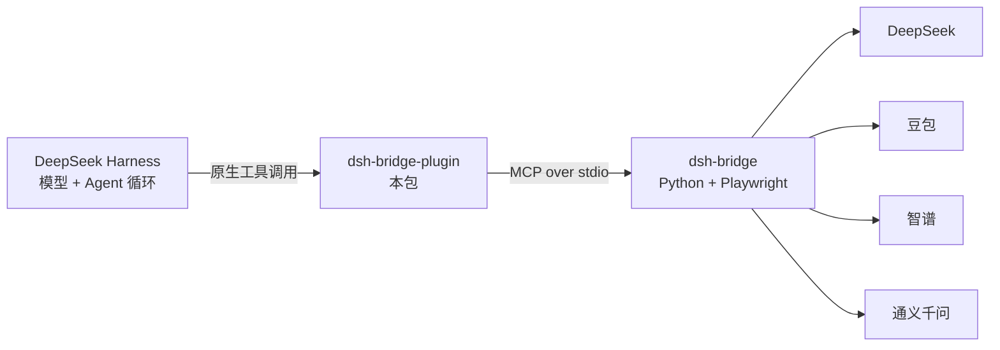

# dsh-bridge-plugin

[](https://www.npmjs.com/package/dsh-bridge-plugin)
[](LICENSE)

> **在 DeepSeek Harness 里直接问 4 个网页版 AI —— 不用 API Key，不花 API 钱。**

`dsh-bridge-plugin` 把本地运行的 [dsh-bridge](https://github.com/elysiamsia/dsh-bridge)
暴露成 **DeepSeek Harness 原生工具**。它驱动 DeepSeek / 豆包 / 智谱 / 通义千问 的
**真实已登录网页会话**，消耗网页版免费额度，而不是付费 API token。

业务逻辑（Playwright 自动化、反检测、降级链、质量审查、频控状态机）**全部留在 Python 侧的
dsh-bridge**；本插件只是一个通过 MCP stdio 复用它的**原生外壳**，**不重写任何逻辑**。

[English](README.md) · [为什么要原生插件？](#为什么要原生插件) · [排障](#排障)



## 特性

| | |
|---|---|
| 🧩 **原生工具** | `ask_deepseek` 直接作为一等 DSH 工具出现，**没有** `mcp__…__` 前缀 |
| ♻️ **共用一份内核** | 与 MCP 接入用的是同一个 Python 桥接，无重复实现 |
| 🛡️ **内置频控闸门** | 站点冻结时**在触网之前**就拒绝发送 |
| 🪶 **零依赖** | 纯 ESM JavaScript，手写 MCP 客户端，无任何 npm 依赖 |
| 🔍 **诊断可选** | 面包屑日志默认关闭，出问题时才打开 |
| 🔌 **失败隔离** | 桥接出问题只影响本插件，绝不会拖垮 DSH |

## 为什么要原生插件？

DeepSeek Harness [本身就支持 MCP](https://github.com/deepseek-ai/deepseek-harness)，
所以走 MCP **零代码**。原生插件换来的是 MCP 给不了的部分：

| | MCP 接入 | 本插件 |
|---|---|---|
| 工具名 | `mcp__dshbridge__ask_deepseek` | `ask_deepseek` |
| UI | MCP 通用呈现 | 原生 `presentCall` 卡片 |
| 配置 | MCP 的 env/args | DSH `Config`（Standard Schema） |
| 生命周期 | 由 MCP 客户端管 | Cordis fiber，卸载/HMR 自动清理 |

## 前置条件

| 条件 | 说明 |
|---|---|
| **DeepSeek Harness** | 桌面版 `0.2.0-rc.2` 实测通过；声明 `dsh >= 0.1.7-rc.1` |
| **Node.js ≥ 20** | DSH 宿主自带 |
| **dsh-bridge** | Python 项目（`uv` 管理，Python ≥ 3.11） |
| **Playwright 浏览器** | 在 dsh-bridge 里跑 `uv run playwright install chromium` |
| **站点登录态** | 真站调用前先 `uv run dsh-login <site>` |

## 安装

### 方式 1 — npm（最简单）

DSH 里打开 **设置 → 插件 → 添加插件**，粘贴包名：

```
dsh-bridge-plugin
```

或命令行：

```sh
dsh plugin add dsh-bridge-plugin
```

### 方式 2 — 本地目录

克隆本仓库后，在「添加插件」里填该目录路径；或使用自带的离线安装脚本
（等价于 `dsh plugin add`，并额外做安装后校验）：

```powershell
powershell -ExecutionPolicy Bypass -File install.ps1
# 卸载：
powershell -ExecutionPolicy Bypass -File install.ps1 -Uninstall
```

### 方式 3 — GitHub

```
https://github.com/elysiamsia/dsh-bridge-plugin
```

> **装完要完全退出并重启 DSH Desktop。** 关窗口可能只是最小化到托盘 ——
> 请从托盘图标退出，或确认任务管理器里没有 `DeepSeek Harness` 进程。

## 配置

**本包不含任何机器专属路径** —— 默认假定 `dsh-bridge` 已在 `PATH` 上
（例如在 dsh-bridge 目录里执行过 `uv tool install .`）。

而**从源码目录用 `uv run` 启动**才是最常见的情况，那种路径属于**你自己的机器**、
不该写进发布包。请在 `~/.dsh/profiles/<profile>/cordis.patch.yml` 里追加覆盖：

```yaml
# 换成你自己机器上 dsh-bridge 检出目录的绝对路径
- id: dsh-bridge-plugin
  config:
    command: uv
    args: [run, --no-sync, dsh-bridge]
    cwd: /absolute/path/to/dsh-bridge
    toolCallTimeoutMs: 180000
```

> patch 会**整体替换**该 id 的 `config` 对象，所以要把需要的字段写全。

<details>
<summary><b>全部配置字段</b></summary>

| 字段 | 默认 | 作用 |
|---|---|---|
| `command` | `dsh-bridge` | 启动桥接的可执行文件 |
| `args` | `[]` | 传给 `command` 的参数 |
| `cwd` | `""` | 工作目录（空则继承） |
| `env` | `{}` | 追加环境变量 |
| `toolCallTimeoutMs` | `180000` | 单次调用超时；真站 ask 要驱动浏览器 |

子进程上**始终强制** `PYTHONIOENCODING=utf-8` 与 `PYTHONUTF8=1` ——
桥接会打 emoji，Windows 默认 GBK 控制台会让它崩。

</details>

## 使用

插件加载后，模型可直接调用：

```
用 ask_deepseek 解释 CAP 定理，再用两句话总结。
```

<details>
<summary><b>工具参考</b></summary>

| 工具 | 参数 | 返回 |
|---|---|---|
| `ask_deepseek` | `prompt`（必填）、`conversation_id`（选填） | `{ reply, conversation_id?, site }` |
| `dsh_bridge_probe` | `echo`（选填） | `{ ok, plugin, echo? }` —— 证明插件已加载 |

`dsh_bridge_probe` 是零依赖诊断工具：**它能用而 `ask_deepseek` 不能用**，
说明问题在桥接层，不在插件。

</details>

## ⚠️ 频控铁律（用真站前必读）

本项目围绕一条硬规则设计：

> **每跑 1 次真站冒烟 = 4 个站点账号同时吊销。**

| 规则 | |
|---|---|
| 允许的站点 | 仅 `deepseek`，且仅限冒烟 |
| 前置条件 | `uv run --no-sync dsh-verify readiness` 必须报告 `hours_left >= 6.0` |
| 续期 | `uv run --no-sync dsh-login deepseek` |

**桥接的 `ask` 路径本身不检查频控**，所以本插件加了一道**前置闸门**：发送前先用
桥接里**纯逻辑**的 `route_task`（不起浏览器、不触网）读一次 verify 状态，站点冻结就
拒绝，并返回可执行的 `dsh-login` 指引。**若前置检查本身失败，插件选择"保守拒绝"**，
而不是冒着误发的风险继续。

## 排障

### 打开诊断日志

日志**默认关闭**。需要时对一次运行开启：

```powershell
$env:DSH_BRIDGE_PLUGIN_DIAG = "$env:TEMP\dsh-bridge-plugin.log"
```

开启后，插件会写入模块导入、`apply` 入口（含 `ctx` 的真实形状）、每一步、以及任何异常的
完整栈。"插件能加载但工具不出现"这类问题，就是靠它**不用猜**解决的。

### 工具不出现

| 现象 | 检查 |
|---|---|
| 插件行显示「异常」 | 打开 `DSH_BRIDGE_PLUGIN_DIAG`，日志会指出失败在哪一步 |
| 插件列表里根本没有 | 没装上，或 DSH 没有**完全**重启 |
| DSH 启动即崩 | `%APPDATA%\@deepseek-ai\dsh-desktop\logs\crash-*-host.log` |

<details>
<summary><b>profile 清单带 UTF-8 BOM 会让 DSH 启动崩溃</b></summary>

DSH 读 profile 的 `package.json` 时直接 `JSON.parse`。带 BOM 会抛
`SyntaxError: Unexpected token ''`（在 `readProfileManifest`），即启动崩溃。

Windows PowerShell 5.1 的 `Set-Content -Encoding UTF8` **会写 BOM**。务必写无 BOM：

```powershell
[System.IO.File]::WriteAllText($path, $json, (New-Object System.Text.UTF8Encoding($false)))
```

`install.ps1` 已经这样做并会断言结果。注意**反向的坑**：含非 ASCII 的 **PowerShell
脚本本身必须有 BOM**，否则 PS 5.1 会按 GBK 解码、直接语法错。

</details>

## 开发

```sh
node probe/verify-plugin.mjs                    # 纯函数 + 注册层，不需要浏览器
# 想连真实桥接一起验：
export DSH_BRIDGE_REPO=/path/to/dsh-bridge      # PowerShell: $env:DSH_BRIDGE_REPO="..."
node probe/verify-plugin.mjs
```

| 脚本 | 用途 |
|---|---|
| `probe/verify-plugin.mjs` | 自检：纯函数、工具注册、前置闸门、桥接 |
| `probe/verify-loader.mjs` | 复现宿主 loader 的 6 步，针对已安装 profile |
| `probe/verify-profile.mjs` | profile 健康检查（逐 bundle，含 BOM 检测） |
| `probe/mcp-probe.mjs` | 纯 Node → Python 的 MCP 握手 + `tools/list` |
| `probe/asar-extract.mjs` | 从 DSH 的 `app.asar` 抽文件（`DSH_ASAR=…`） |

机器专属路径**从不入库**：所有脚本都从环境变量取，缺了会明确告诉你该设什么。

## 发版

发版由 [`.github/workflows/publish.yml`](.github/workflows/publish.yml) 自动化：推送 `v*` tag 即发布到 npm。

```sh
npm version patch        # 或 minor / major —— 会改 package.json 并创建 tag
git push --follow-tags   # tag 触发 workflow
```

workflow 会校验 tag 与 `package.json` 一致、跑一遍离线自检，然后带 provenance 发布。
它需要仓库密钥 `NPM_TOKEN` —— 一个**勾选了「Bypass 2FA」的 Granular Access Token**
（本 npm 账号开了 2FA；普通 token 会在 CI 里被拒 `E403`）。也可以在 Actions 页面手动触发，
默认是 `--dry-run`。

## 贡献

欢迎提 Issue 与 PR。开 PR 前请先跑上面的自检，并保持**零依赖**约束 ——
本包必须能通过 `dsh plugin add` 直接安装，**无构建步骤、无传递依赖**。

## 许可

[MIT](LICENSE)

## 致谢

- [dsh-bridge](https://github.com/elysiamsia/dsh-bridge) —— 本插件驱动的 Python 浏览器桥接
- [DeepSeek Harness](https://github.com/deepseek-ai/deepseek-harness) —— 宿主及其 Cordis 插件系统
